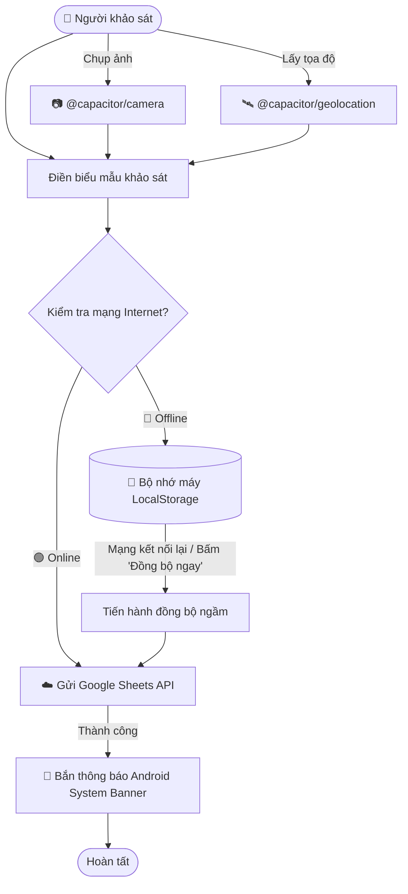

# 📋 VKU Field Survey - Ứng dụng Khảo sát Hiện trường

[](https://capacitorjs.com/)
[](https://developer.android.com/)
[](https://vitejs.dev/)
[]()
[]()

> Ứng dụng di động lai (**Hybrid Mobile App**) phục vụ công tác khảo sát, đánh giá cơ sở vật chất và hiện trường tại **Trường Đại học Công nghệ Thông tin & Truyền thông Việt - Hàn (VKU)**. Hỗ trợ hoạt động offline toàn diện, tích hợp trực tiếp phần cứng camera, GPS vệ tinh và đồng bộ dữ liệu tự động lên Google Sheets.

---

## 🌟 Tính năng nổi bật (Key Features)

| Tính năng | Mô tả chi tiết | Công nghệ tích hợp |
| :--- | :--- | :--- |
| 📷 **Chụp ảnh hiện trường** | Chụp ảnh hiện trường trực tiếp từ Camera native thiết bị, nén ảnh tự động và hiển thị khung xem trước (Preview) | `@capacitor/camera` |
| 🛰️ **Định vị vệ tinh GPS** | Lấy tọa độ kinh độ, vĩ độ với độ chính xác cao (`±Xm`), tạo liên kết Google Maps tương ứng | `@capacitor/geolocation` |
| 📴 **Chế độ Offline toàn diện** | Lưu tạm các bản ghi khảo sát vào bộ nhớ máy (`localStorage`) khi mất mạng hoặc kết nối yếu | Offline-First Engine |
| 🔄 **Tự động đồng bộ (Auto-Sync)** | Tự động phát hiện khi thiết bị có mạng trở lại và đẩy toàn bộ dữ liệu đang chờ lên hệ thống | Network Listener |
| 🔔 **Thông báo hệ thống Android** | Bắn thông báo đẩy (Native System Notification) trên thanh thông báo khi đồng bộ hoàn tất | `@capacitor/local-notifications` |
| 📊 **Lưu trữ Google Sheets** | Gửi và lưu trữ dữ liệu tập trung qua Google Apps Script Web App API | Google Apps Script REST API |
| 📦 **File APK Release Đã Ký** | Đi kèm file APK độc lập (`vku-survey-release.apk`) đã ký số, cài đặt trực tiếp không cần IDE | Android Gradle Release Build |

---

## 🏗️ Kiến trúc & Luồng hoạt động (Architecture)



---

## 📁 Cấu trúc thư mục dự án (Project Structure)

```text
vku-field-survey/
├── android/                         # Dự án mã nguồn Native Android (Gradle project)
│   ├── app/
│   │   ├── src/main/
│   │   │   ├── AndroidManifest.xml  # Khai báo các quyền Camera, GPS, Notifications
│   │   │   ├── java/                # MainActivity Java của ứng dụng
│   │   │   └── res/                 # Tài nguyên icon, splash screen, layout
│   │   ├── build.gradle             # Cấu hình build & release signing keystore
│   │   └── vku-survey.keystore      # Keystore ký số bản release
│   └── build.gradle
├── dist/                            # Thư mục chứa bundle web sau khi build
├── index.html                       # Giao diện chính của ứng dụng
├── app.js                           # Logic xử lý Camera, GPS, Offline queue, Sync & Thông báo
├── style.css                        # Bảng mã màu, kiểu dáng giao diện mobile-first
├── manifest.json                    # Cấu hình PWA Web App Manifest
├── sw.js                            # Service Worker hỗ trợ caching
├── capacitor.config.json            # File cấu hình Capacitor (App ID, Plugin config)
├── vite.config.js                   # Cấu hình bundler Vite
├── package.json                     # Danh sách dependencies & scripts
├── vku-survey-release.apk           # File APK đã ký số, sẵn sàng cài đặt
└── README.md                        # Tài liệu hướng dẫn dự án
```

---

## 🚀 Hướng dẫn Cài đặt & Phát triển (Getting Started)

### 1. Yêu cầu môi trường
- **Node.js**: Phiên bản 18+ hoặc mới hơn
- **Java Development Kit (JDK)**: JDK 17 hoặc JDK 21
- **Android SDK**: API level 30 đến 35 (Android 11 - 15)

### 2. Cài đặt thư viện
```bash
# Clone repository
git clone https://github.com/Kietna135/vku-field-survey.git
cd vku-field-survey

# Cài đặt các gói phụ thuộc
npm install
```

### 3. Các lệnh thực thi (Commands)

| Lệnh | Chức năng |
| :--- | :--- |
| `npm run dev` | Chạy máy chủ phát triển Web tại `http://localhost:3000` |
| `npm run build` | Biên dịch tối ưu hóa giao diện web vào thư mục `dist/` |
| `npm run cap:sync` | Đồng bộ mã nguồn web và plugin vào thư mục `android/` |
| `npm run cap:open` | Mở trực tiếp dự án trong Android Studio |
| `npm run build:apk` | Tự động build web $\rightarrow$ sync $\rightarrow$ biên dịch ra file APK đã ký |
| `npm run build:debug` | Biên dịch bản Debug APK |

---

## 📲 Cài đặt & Sử dụng File APK trên điện thoại

1. **Tải file APK:**
   - File APK đã biên dịch sẵn nằm trực tiếp tại thư mục gốc dự án: `vku-survey-release.apk` (Dung lượng ~5.9 MB).
2. **Cài đặt qua cáp USB (ADB):**
   ```powershell
   adb install vku-survey-release.apk
   ```
3. **Cài đặt thủ công:**
   - Chuyển file `vku-survey-release.apk` vào điện thoại qua Zalo, Google Drive, Email hoặc cáp USB.
   - Nhấn mở file trên điện thoại và chọn **Cài đặt (Install)**.

---

## 🧪 Kịch bản Kiểm thử Thực tế (Testing Guide)

### 1. Kiểm thử Camera
- Bấm **"📷 Chụp ảnh hiện trường"** $\rightarrow$ Hệ thống mở Camera thiết bị $\rightarrow$ Chụp ảnh $\rightarrow$ Khung xem trước hiển thị với nhãn `✅ Đã chụp ảnh thành công`.
- Có thể bấm nút **✕** để xóa ảnh và chụp lại ảnh mới.

### 2. Kiểm thử GPS
- Bấm **"🛰️ Lấy vị trí GPS"** $\rightarrow$ Cấp quyền truy cập vị trí $\rightarrow$ Ứng dụng tự động hiển thị tọa độ Vĩ độ, Kinh độ và bán kính sai số (VD: `15.975312, 108.252345 (±8m)`).

### 3. Kiểm thử Khảo sát Offline & Tự động đồng bộ
1. Bật **Chế độ máy bay (Airplane Mode)** trên điện thoại $\rightarrow$ Thanh trạng thái đổi sang **🔴 Offline**.
2. Điền form khảo sát, đính kèm ảnh và tọa độ GPS $\rightarrow$ Bấm **"Gửi khảo sát"**.
3. Ứng dụng thông báo đã lưu ngoại tuyến an toàn $\rightarrow$ Bộ đếm **"Chờ đồng bộ"** nhảy lên **1**.
4. Tắt **Chế độ máy bay** (kết nối lại WiFi/4G) $\rightarrow$ Thanh trạng thái đổi sang **🟢 Online**.
5. Ứng dụng tự động kích hoạt đồng bộ (hoặc bấm nút **"Đồng bộ ngay"**).
6. Khi hoàn tất, một **thông báo đẩy của hệ thống Android (Native Notification)** xuất hiện với nội dung:
   > 🎉 **Đồng bộ thành công!**  
   > *Đã gửi thành công 1 khảo sát hiện trường lên Google Sheets.*

---

## 🛠️ Công nghệ sử dụng (Tech Stack)

- **Frontend Core:** HTML5, Modern Vanilla JavaScript (ES6+ Modules), CSS3 (Mobile-First Card UI)
- **Native Hybrid Framework:** [Capacitor 7](https://capacitorjs.com/)
- **Native Plugins:**
  - `@capacitor/camera` (Camera phần cứng)
  - `@capacitor/geolocation` (Định vị vệ tinh GPS)
  - `@capacitor/local-notifications` (Thông báo đẩy hệ thống)
- **Bundler & Build Tool:** [Vite 6](https://vitejs.dev/)
- **Backend & Database:** Google Apps Script + Google Sheets Spreadsheet Database
- **Android Toolchain:** Gradle 8.10, Android SDK Build Tools 34/35

---

## 📄 Bản quyền (License)

Dự án được phát triển phục vụ mục đích học tập và triển khai thực tế tại Trường Đại học Công nghệ Thông tin & Truyền thông Việt - Hàn (VKU).
